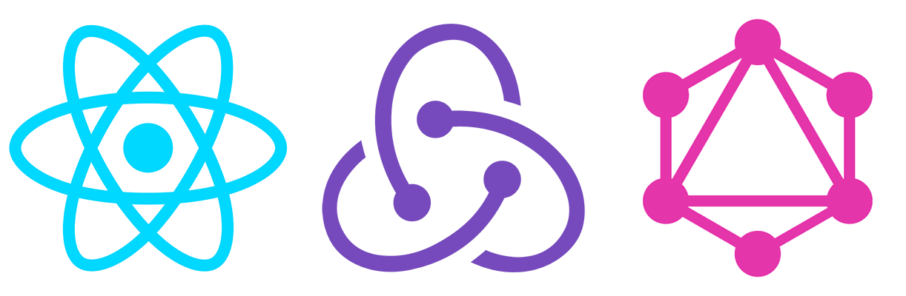

  

# React GraphQL Practice

> Full stack online clothing store using React Apollo GraphQL and Prisma.

## Prerequisites

- NodeJS and NPM
- Chrome React Dev Tools
- Chrome Redux Dev Tools

## Running

First `npm install` to grab all the necessary dependencies.

Then run `npm start` and open <localhost:7770> in your browser.

## Production Build

Run `npm build` to create a dist folder and a bundle.js file.